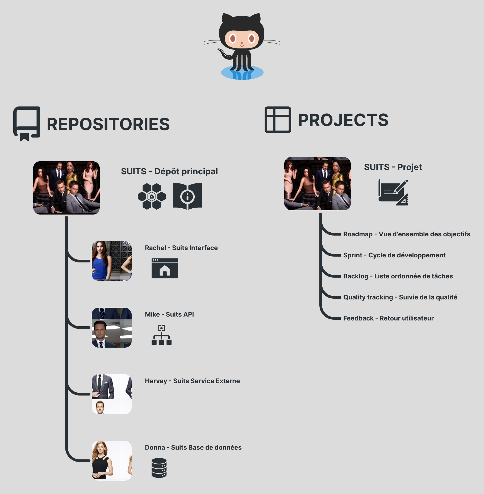

# Suits

Dépôt principal du projet Suits - Travail collaboratif pour améliorer les compétences

|    |    |    |    |    |
|--- |--- |--- |--- |--- |
|   |  |  | |
|    |    |    |    |    |

## Table des matières

  
⬇️⬇️⬇️

  <ul>
    <li><a href="#description">Description</a></li>
    <li><a href="#github">Github</a></li>
    <li>
      <a href="#par-où-commencer">Par où commencer</a>
      <ul>
        <li><a href="#documentation">Documentation</a></li>
        <li><a href="#installation">Installation</a></li>
        <li><a href="#processus">Processus</a></li>
        <li><a href="#versions">Versions</a></li>
      </ul>
    </li>
    <li>
      <a href="#structure">Structure</a>
      <ul>
        <li><a href="#schéma-de-lapplication">Schéma de l'application</a></li>
        <li><a href="#api">Mike - Suits API</a></li>
        <li><a href="#interface">Rachel - Suits Interface</a></li>
        <li><a href="#service">Harvey - Suits Service Externe</a></li>
        <li><a href="#database">Donna - Suits Base de données</a></li>
      </ul>
    </li>
    <li>
      <a href="#getting-started">Démarrage</a>
      <ul>
        <li><a href="#prérequis">Prérequis</a></li>
        <li><a href="#exigences">Exigences</a></li>
      </ul>
    </li>
    <li>
      <a href="#feuille-de-route">Feuille de route</a>
      <ul>
        <li><a href="#etapes-clés">Étapes clés</a></li>
      </ul>
    </li>
    <li><a href="#contributeurs">Contributeurs</a></li>
    <li><a href="#contribuer">Contribuer</a></li>
    <li><a href="#licence">Licence</a></li>
    <li><a href="#credits">Crédits</a></li>
  </ul> 

## Description 

Mettre en relation des entreprises avec des personnes à la recherche de nouvelles opportunités professionnelles.

<a  href="#Suits">⬆️</a>

## Github 

<a  href="#Suits">⬆️</a>

## Par où commencer

Par où commencer
1. Readme

3. Pour installer le projet 
  - Pour installer le projet : Suits/doc/instalation
  - Ce connecter au manager de base de donnée pgadmin : Suits/doc/donna/index.md

2. Contribuer au projet
  - Lire  les stadards BASIC : Lire  les stadards BASIC    
  - Lire  les stadards gestion de projet : Suits/doc/standard/projectManagement.standard.md PAS FINI
    - developper un fonctionalité Lire  les stadards development : Suits/doc/standard/development.standard.md PAS FINI
    - corriger un bug Lire  les stadards issues : Suits/doc/standard/issue.standard.md PAS FINI
    - comprendre le management des versions : Suits/doc/version.standard.md
  - Outils de versioning du projet 
    - git : Suits/doc/versionning/git.app.md Commandes de bases, pas fini
    - gitflow : Suits/doc/versionning/gitflow.app.md  Commandes de bases, pas fini
      - S’entrainner à utiliser gitflow : Suits/doc/versionning/gitflow.project.md si tu n’utilise pas gitflow régulièrement fait le 

  
### Documentation

- Norme projet (.standard) : Définiton des normes du projet et commandes de base
- Application (.app) : Documentation et ressources pour l'application
- Projet (.project) : Exercice de démarrage, à compléter avant de commencer si tu n'est pas familier avec cette technologie

### Installation

- [Guide d'installation](https://github.com/j-renevier/Suits/blob/master/doc/instalation.md "Documentation")

- [Guide d'installation - Github](https://github.com/j-renevier/Suits/blob/master/doc/instalation.md "Documentation")

### Processus

- [Processus de développement](./doc/standard/development.standard.md)
- [Processus de correction d'issue](./doc/standard/issue.standard.md)

### Version

- [Processus de gestion de projet - gestion des versions](./doc/standard/projectManagement.standard.md/#gestion-des-versions)

<a  href="#Suits">⬆️</a>

## Structure

### Schéma de l'application

<a  href="#Suits">⬆️</a>

<h3 style="display: flex; align-items:center; gap: 5px" id="api">
  
  Mike - Suits API
</h3>

[Mike - Suits API](https://github.com/j-renevier/mike "Github")

[Mike - Documentation](./doc/mike/index.md "documenation")

<a  href="#Suits">⬆️</a>

<h3 style="display: flex; align-items:center; gap: 5px" id="interface">
  
  Rachel - Suits Interface
</h3>

[Rachel - Suits Interface](https://github.com/j-renevier/maeve "Github")

[Rachel - Documentation](./doc/rachel/index.md "documenation")

<a  href="#Suits">⬆️</a>

<h3 style="display: flex; align-items:center; gap: 5px" id="service">
  
  Harvey - Suits Service Externe
</h3>

[Harvey - Suits Service Externe](https://github.com/j-renevier/harvey "Github")

[Harvey - Documentation](./doc/harvey/index.md "documenation")

<a  href="#Suits">⬆️</a>

<h3 style="display: flex; align-items:center; gap: 5px" id="database">
  
  Donna - Suits Base de données
</h3>

[Donna - Suits Base de données](https://github.com/j-renevier/donna "Github")

[Donna - Documentation](./doc/donna/index.md "documenation")

<a  href="#Suits">⬆️</a>

## Démarrage

### Prérequis

- Savoir lire une documentation

### Exigences

- Outils 
  - Docker
  - Node
- Compétences transverses 
  - Avoir assez de courrage pour lire la doc avant de commencer

<a  href="#Suits">⬆️</a>

## Feuille de route

### Fonctionnalités à venir

- [ ] Architecture du projet
  - [x] Configuration des environnements
  - [ ] Liaison des environnements
- [ ] Gestion de la authentification

### Étapes clés

#### Suits 

<h4 style="display: flex; align-items:center; gap: 5px">
  
  Suits
</h4>

  | Étapes clés | Description                             | Date       |
  | ---         |---                                      |---         |
  | 0.0.1       | Initialisation du projet                | 23/06/2024 |

<h4 style="display: flex; align-items:center; gap: 5px">
  
  Mike - Suits API
</h4>

  | Étapes clés | Description                             | Date       |
  | ---         |---                                      |---         |
  | 0.0.1       | Initialisation du projet                | 23/06/2024 |

<h4 style="display: flex; align-items:center; gap: 5px">
  
  Rachel - Suits Interface
</h4>

  | Étapes clés | Description                             | Date       |
  | ---         |---                                      |---         |
  | 0.0.1       | Initialisation du projet                | 23/06/2024 |

<h4 style="display: flex; align-items:center; gap: 5px">
  
  Donna - Suits Base de données
</h4>

  | Étapes clés | Description                             | Date       |
  | ---         |---                                      |---         |
  | 0.0.1       | Initialisation du projet                | 23/06/2024 |

<h4 style="display: flex; align-items:center; gap: 5px">
  
  Harvey - Suits Service Externe
</h4>

  | Étapes clés | Description                             | Date       |
  | ---         |---                                      |---         |
  | 0.0.1       | Initialisation du projet                | 23/06/2024 |

### Historique des versions

| Étapes clés | Service | Description                     | Date       |
| ---         | ---     | ---                             | ---        |
| 0.0.1       | Suits   | Initialisation du projet        | 23/06/2024 |

<a  href="#Suits">⬆️</a>

## Contributeurs

  

    

      
    

    

      
      <b>Joachim Renevier</b>
    

    

      
      <a href="mailto:joachim.renevier@gmail.com">joachim.renevier@gmail.com</a>
    

    

      
      <a href="https://github.com/j-renevier" title="Mon github">j-renevier</a>
    

  

  

    

      
    

    

      
      <b>John Doe</b>
    

    

      
      <a href="mailto:john.doe@gmail.com">john.doe@gmail.com</a>
    

    

      
      <a href="https://github.com/john.doe" title="Mon github">john.doe</a>
    

  

  

<a  href="#Suits">⬆️</a>

## Contribuer

Voir [Contributing Guide](./CONTRIBUTING.md).

<a  href="#Suits">⬆️</a>

## Licence

Voir [Licence](./LICENSE) pour plus d'informations

<a  href="#Suits">⬆️</a>

## Crédits

<a  href="#Suits">⬆️</a>

