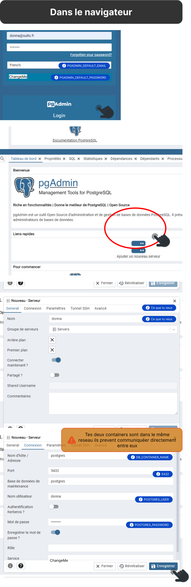
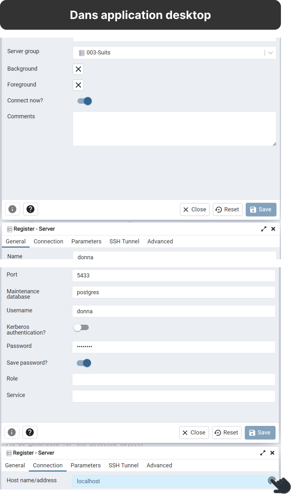

<div align="center">
  
</div>

# Donna - Suits Base de données


<h2 id="clone-donna">Dupliquer le dépôt</h2>

<h3 id="ssh-donna">SSH</h3>

```bash
git clone git@github.com:j-renevier/donna.git
```

<h3 id="http-donna">HTTP</h3>

```bash
git clone https://github.com/j-renevier/donna.git
```

## Variables d'environnement 

Variables minimum dans le .env à la racine du projet

```bash 
# .env
# Value: development | test | build | production
ENV = development
HOST = localhost
DOMAINE_NAME = donna
EXTENSION = .st

DB_CONTAINER_NAME = postgres
POSTGRES_ROOT_PASSWORD = ChangeMe
POSTGRES_USER = donna
POSTGRES_PASSWORD = ChangeMe
POSTGRES_PORT = 5433
POSTGRES_DB = donna

PGADMIN_PORT = 83
PGADMIN_DEFAULT_EMAIL =  donna@suits.fr
PGADMIN_DEFAULT_PASSWORD = ChangeMe
```

## Création de la base avec docker

Start the container

``` bash 
# Donna - Suits Base de données

docker compose up --build
```

## Ce connecter à la base via pgAdmin 

### Via le container créer dans le docker compose 

Dans le navigateur: [pgAdmin](http://localhost:83)



### Via l'application installé sur l'ordinateur 

