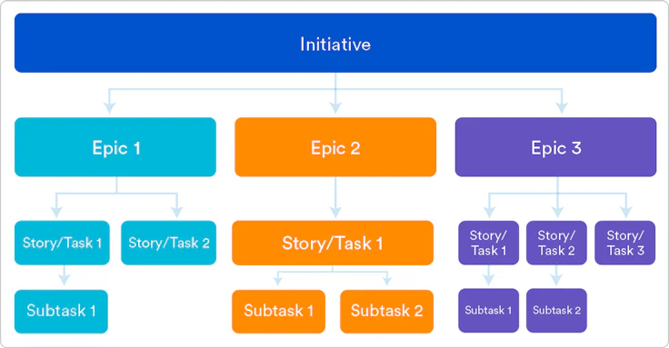

# Gestion du projet

## Table des matières

  
⬇️⬇️⬇️

  <ul>
    <li><a href="#nom-du-projet">Nom du projet</a></li>
    <li><a href="#code-name">Nom de Code</a></li>
    <li><a href="#github">Github</a></li>
    <li><a href="#gestion-de-projet">Gestion de projet</a></li>
  </ul> 

<h2 id="nom-du-projet">Nom du projet</h2>

Pas encore définie 

## Nom de Code 

Le nom de code permet de désigner le produit ou les solutions, servant de référence pour les développeurs.
Le nom du produit peut évoluer, mais le nom de code restera inchangé.

Choix :
- Nom de code projet : correspond au premier nom de la série qui me vient à l'esprit.
- Nom de code service : un service porte le nom d'un personnage de la série.

## Github 

## Gestion de projet 

Baser sur l'agilité et/ou le scrum
Chacun contribut en ajoutant des fonctionalitées

### Epic 

⚠️ Interpretation (je pense que sa sert a rien)
Regroupe un ensemble de tache ou story pour repondre à un besoin utilisateur 

### Story

Besoin fonctionnel 

1. Utilisateur type : quelles sont les caractéristiques de l’utilisateur final ?
2. Besoin : quel est le besoin de l’utilisateur final ?
3. Objectif : quel est l’objectif de la fonctionnalité logicielle pour l’expérience de l’utilisateur final ?

#### Template  
  - Titre
  - Rapide Description
  - Besoin fonctionnel détailler (utilisation du langage naturel)
    En tant que 
    Qaund 
    Alors 
  - Besoin spécifique détailler pouvant être subdiviser en sous-tâches

#### Exemple 

Titre :
En tant qu'utilisateur, je souhaite pouvoir administrer mon profil.

Rapide Description :
Un utilisateur peu acceder au détails de son profil pour le modifier

En tant qu'utilisateur,
Quand je veux acceder aux détails de mon profil,
Alors un lien de redirection vers la page profil est disponible dans le menu.

En tant qu'utilisateur,
Quand je veux modifier mon profil,
Alors je valide le formulaire d'edition de mon profil mes information personnelles sont mises à jours.

Besoin spécifique détaillé ou sous-tâches :
1. Ajouter un lien vers le profil dans le menu de navigation.
2. Créer une page profil. 
3. Formulaire de Modification de Profil
4. Api de mise à jour 

#### Critères INVEST

- Indépendante : La user story peut être réalisée de manière autonome.
- Négociable : Les détails peuvent être discutés et ajustés entre l'équipe et le client.
- Estimable : La taille et la complexité de la user story peuvent être estimées.
- Valuable : La user story apporte de la valeur pour l'utilisateur ou le client.
- Small : La user story est suffisamment petite pour être complétée dans un seul sprint.
- Testable : Les critères de réussite peuvent être définis clairement pour vérifier l'achèvement de la user story.

### Tâche

Besoin technique

### Issue

#### Anomalie 

Elle désigne tout défaut, bogue, erreur de conception, de réalisation, de programmation ou autre, portant sur tout ou partie du site et tout résultat incorrect ou non conforme aux fonctionnalités du site.

#### Evolution 

Amélioration ou changement planifié nécessaire pour répondre à de nouvelles exigences fonctionnelles ou pour optimiser le système existant.

#### Template  
  - Titre
  - Resumer
    - Instance (local / distante)
    - Environnment (production / developpement)
    - Version
    - Context (navigatuer utiliser)
    - Description
  - Etape de reproduction
  - Comportement actuel
  - Comportement attendue
  - Détails supplémentaire (log / capture d'écrans)

### Incidents

#### Assitance 

Support fourni aux utilisateurs pour résoudre des problèmes techniques ou répondre à des questions concernant l'utilisation du site.

#### Question

Demande d'information ou de clarification sur une fonctionnalité, un processus ou tout autre aspect du site.

#### Rapport d'incident

