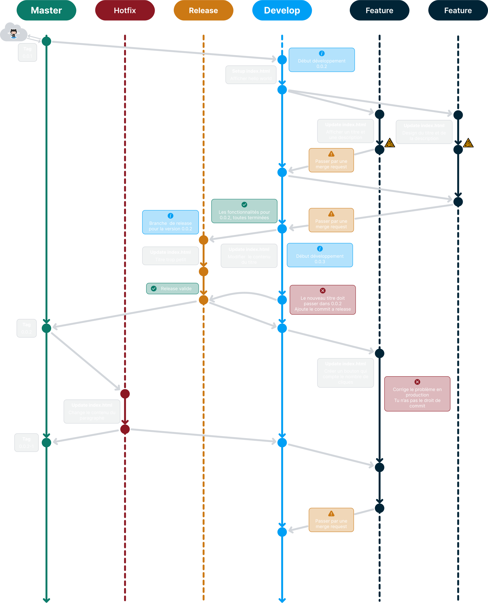
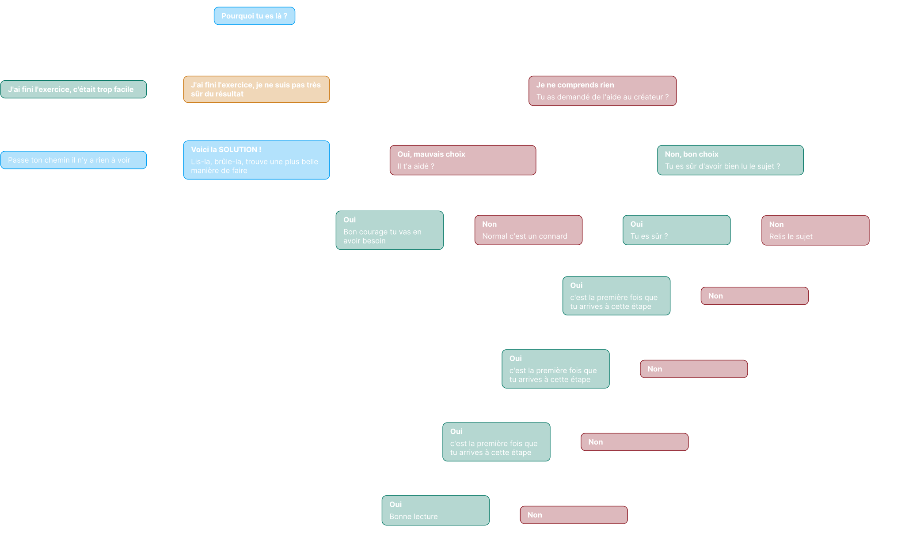

# Git flow 

## Introduction 

### Objctifs 

Comprendre le worflow gitflow
Se familiarsiser avec les commandes de git flow

### Prerequis

Être à l'aise avec le fonctionnement général de git

### Schéma Gitflow de référence 


### Ressources 

[Ressource interne git](./git.app.md)

[Ressource interne gitflow](./gitFlow.app.md)

[Ressource externe](https://letmegooglethat.com/)

## Gitflow

### Avant de partir 

Créer un dépôt distant vide

Faire un faux projet contenent **un seul fichier** index.html (html et css au même endroit)
Il est interdit de modifier les balise html et le style dans la même banche de feature (sinon ça va pas être très fun)

1. Clonner le dêpot distant 
2. Initialiser le dêpot avec git flow
3. Reproduire le graphique si dessous



### Exemple

[Repository Gitflow](https://github.com/j-renevier/gitflow)

### Besoin d'aide, que faire ? 



### Ma correction (ce que je pense être le mieux lors de la conception de l'exercice)

```bash

# 1. Créer un dêpot distant sur github

# 2. Créer un dossier local contenant le projet
mkdir gitflow

# 3. Ce déplacer dans le dossier du projet (et oui une fois sur deux cette étape est oublié)
cd gitflow/  

# 4. Initier le projet avec git flow 
git flow init

# 5. Configurer la structure des branches du projet
Initialized empty Git repository in C:/Users/rapha/project/003-Suits/gitflow/.git/
No branches exist yet. Base branches must be created now.
Branch name for production releases: [master]
Branch name for "next release" development: [develop]

How to name your supporting branch prefixes?
Feature branches? [feature/]
Bugfix branches? [bugfix/]
Release branches? [release/]
Hotfix branches? [hotfix/]
Support branches? [support/]
Version tag prefix? []
Hooks and filters directory? [C:/Users/rapha/project/003-Suits/gitflow/.git/hooks]

# --- Etat du projet --- #
git log --oneline --graph --decorate --all 

* 5a405e0 (HEAD -> develop, master) Initial commit
# ---------------------- #

# 6. Lier le projet local avec le dêpot distant 
git remote add origin git@github.com:j-renevier/gitflow.git

# 7. Publier les branches de départ
git push -u origin master
git push -u origin develop

# Si il y a déjà une branche main (=master) sur ton dêpot 
# tu l'efface, master devient la branche principale
# ou tu renomme main en master (normalement tu devrais pas avoir de problème, non je rigole j'en sais rien démerde toi)

# 8. Créer un tag 
git tag 0.0.1

# 9. Publier un tag
git push origin 0.0.1  

# 10. Voir le status de la branche (Depuis develop)
git status 

On branch develop
Your branch is up to date with 'origin/develop'.

Untracked files:
  (use "git add <file>..." to include in what will be committed)
        index.html

nothing added to commit but untracked files present (use "git add" to track)

# 11. staged modification (Depuis develop)
git add .    

# 12. Commit les modification (Depuis develop)
git commit -m"feat(index): hello world"

[develop 7461e61] feat(index): hello world
 1 file changed, 11 insertions(+)
 create mode 100644 index.html

# 13. Mettre à jour le dêpot distant (Depuis develop)
git push

# 14. Créer les branches de feature (Depuis develop)
git flow feature start GF1-structure

Switched to a new branch 'feature/GF1-structure'

Summary of actions:
- A new branch 'feature/GF1-structure' was created, based on 'develop'
- You are now on branch 'feature/GF1-structure'

Now, start committing on your feature. When done, use:

     git flow feature finish GF1-structure


git flow feature start GF2-style

Switched to a new branch 'feature/GF2-style'

Summary of actions:
- A new branch 'feature/GF2-style' was created, based on 'develop'
- You are now on branch 'feature/GF2-style'

Now, start committing on your feature. When done, use:

     git flow feature finish GF2-style

# 15. Commit les changements (Depuis feature/GF1-structure)
git add .

git commit -m"feat(main): add structure in root file"

[feature/GF1-structure 9eef444] feat(main): add structure in root file
 1 file changed, 2 insertions(+), 1 deletion(-)

# 16. Publier la branche feature/GF1 (Depuis feature/GF1-structure)
git flow feature publish

ou 

git push --set-upstream origin feature/GF1-structure

Enumerating objects: 5, done.
Counting objects: 100% (5/5), done.
Delta compression using up to 8 threads
Compressing objects: 100% (2/2), done.
Writing objects: 100% (3/3), 550 bytes | 550.00 KiB/s, done.
Total 3 (delta 0), reused 0 (delta 0), pack-reused 0
remote:
remote: Create a pull request for 'feature/GF1-structure' on GitHub by visiting:
remote:      https://github.com/j-renevier/gitflow/pull/new/feature/GF1-structure
remote:
To github.com:j-renevier/gitflow.git
 * [new branch]      feature/GF1-structure -> feature/GF1-structure
branch 'feature/GF1-structure' set up to track 'origin/feature/GF1-structure'.
Already on 'feature/GF1-structure'
Your branch is up to date with 'origin/feature/GF1-structure'.

Summary of actions:
- The remote branch 'feature/GF1-structure' was created or updated
- The local branch 'feature/GF1-structure' was configured to track the remote branch
- You are now on branch 'feature/GF1-structure'

# 17. Commit les changements et publier les modifications (Depuis feature/GF2-style)
git add .

git commit -m"style(main): setup base style"

git flow feature publish

...
Summary of actions:
- The remote branch 'feature/GF2-style' was created or updated
- The local branch 'feature/GF2-style' was configured to track the remote branch
- You are now on branch 'feature/GF2-style'


# 18. Merge feature/GF1 dans develop (via github ou gitlab)

# 19. Mettre à jour develop dans le projet local (Depuis develop)
git pull 

remote: Enumerating objects: 1, done.
remote: Counting objects: 100% (1/1), done.
remote: Total 1 (delta 0), reused 0 (delta 0), pack-reused 0
Unpacking objects: 100% (1/1), 928 bytes | 185.00 KiB/s, done.
From github.com:j-renevier/gitflow
   7461e61..a45f149  develop    -> origin/develop
Updating 7461e61..a45f149
Fast-forward
 index.html | 3 ++-
 1 file changed, 2 insertions(+), 1 deletion(-)

# --- Etat du projet --- #
git log --oneline --graph --decorate --all 

*   a45f149 (HEAD -> develop, origin/develop) Merge pull request #1 from j-renevier/feature/GF1-structure
|\
| * 9eef444 (origin/feature/GF1-structure, feature/GF1-structure) feat(main): add structure in root file
|/
| * d9a535e (origin/feature/GF2-style, feature/GF2-style) style(main): setup base style
|/
* 7461e61 feat(index): hello world
* 5a405e0 (tag: 0.0.1, origin/master, master) Initial commit
# ---------------------- #

# 20. Mettre à jour feature/GF2 en intégrant les nouvelles fonctionnalité de develop (s'assurer de récuperer toutes les modification de develop)

# Depuis develop 
git pull

# Depuis feature/GF2
git rebase develop

Successfully rebased and updated refs/heads/feature/GF2-style. # J'espère que ton rebase sera plus compliquer que le miens 

git push

# L'historique local n'est plus a jour par rapport à l'historique distant git empêche la mise à jour de la branche distante 
To github.com:j-renevier/gitflow.git
 ! [rejected]        feature/GF2-style -> feature/GF2-style (non-fast-forward)
error: failed to push some refs to 'github.com:j-renevier/gitflow.git'
hint: Updates were rejected because the tip of your current branch is behind
hint: its remote counterpart. If you want to integrate the remote changes,
hint: use 'git pull' before pushing again.
hint: See the 'Note about fast-forwards' in 'git push --help' for details.

git push -f

# Ta branch local écrase ta branche distante, j'espère que tout ce à quoi tu tennais étais dans ta branche local et pas dans ta branche distante.
Enumerating objects: 5, done.
Counting objects: 100% (5/5), done.
Delta compression using up to 8 threads
Compressing objects: 100% (2/2), done.
Writing objects: 100% (3/3), 407 bytes | 407.00 KiB/s, done.
Total 3 (delta 1), reused 0 (delta 0), pack-reused 0
remote: Resolving deltas: 100% (1/1), completed with 1 local object.
To github.com:j-renevier/gitflow.git
 + d9a535e...f47d249 feature/GF2-style -> feature/GF2-style (forced update)

# 21. Merge feature/GF2 dans develop (via github ou gitlab)

# --- Etat du projet --- #
git log --oneline --graph --decorate --all 

*   db5e6ad (HEAD -> develop, origin/develop) Merge pull request #2 from j-renevier/feature/GF2-style
|\
| * f47d249 style(main): setup base style
|/
*   a45f149 Merge pull request #1 from j-renevier/feature/GF1-structure
|\
| * 9eef444 feat(main): add structure in root file
|/
* 7461e61 feat(index): hello world
* 5a405e0 (tag: 0.0.1, origin/master, master) Initial commit
# ---------------------- #

# 22. Créer une branche de release, phase de test en vue du déploiement des nouvelles fonctionnalités (Depuis develop)
git flow release start 0.0.2

git flow release publish

Total 0 (delta 0), reused 0 (delta 0), pack-reused 0
remote:
remote: Create a pull request for 'release/0.0.2' on GitHub by visiting:
remote:      https://github.com/j-renevier/gitflow/pull/new/release/0.0.2
remote:
To github.com:j-renevier/gitflow.git
 * [new branch]      release/0.0.2 -> release/0.0.2
branch 'release/0.0.2' set up to track 'origin/release/0.0.2'.
Already on 'release/0.0.2'
Your branch is up to date with 'origin/release/0.0.2'.

Summary of actions:
- The remote branch 'release/0.0.2' was created or updated
- The local branch 'release/0.0.2' was configured to track the remote branch
- You are now on branch 'release/0.0.2'

# 23. Partager une correction (Depuis release/0.0.2)
git add .         

git commit -m"fix(title style): increase title font size, close  #1"

# Tu es pas tout seul a travailler sur release, pour pas écraser le travail des autres pull avant de push
git pull 

git push

# 24. Commit des changements (Depuis develop)
git add .

git commit -m"feat(title): Change the content of the title"

git push


# 25. Ajouter le dernier commit de develop à release/0.0.2 (Depuis release/0.0.2)
git cherry-pick develop

git push

# 26. Finaliser la release, publication du code (Depuis release/0.0.2)
git flow release finish 0.0.2

Switched to branch 'develop'
Your branch is up to date with 'origin/develop'.
Auto-merging index.html
Merge made by the 'ort' strategy.
 index.html | 2 +-
 1 file changed, 1 insertion(+), 1 deletion(-)
To github.com:j-renevier/gitflow.git
 - [deleted]         release/0.0.2
Deleted branch release/0.0.2 (was ac1e4fd).

Summary of actions:
- Release branch 'release/0.0.2' has been merged into 'master'
- The release was tagged '0.0.2'
- Release tag '0.0.2' has been back-merged into 'develop'
- Release branch 'release/0.0.2' has been locally deleted; it has been remotely deleted from 'origin'
- You are now on branch 'develop'

# Depuis develop
git push --tags

# --- Etat du projet --- #
git log --oneline --graph --decorate --all 

*   ef6c263 (HEAD -> develop, origin/develop) Merge tag '0.0.2' into develop
|\
| *   1f68ccf (tag: 0.0.2, origin/master, master) Merge branch 'release/0.0.2'
| |\
| | * ac1e4fd feat(title): Change the content of the title
| | * a42579e fix(title style): increase title font size, close  #1
* | | 68c50be feat(title): Change the content of the title
| |/
|/|
* |   db5e6ad Merge pull request #2 from j-renevier/feature/GF2-style
|\ \
| * | f47d249 style(main): setup base style
|/ /
* |   a45f149 Merge pull request #1 from j-renevier/feature/GF1-structure
|\ \
| * | 9eef444 feat(main): add structure in root file
|/ /
* / 7461e61 feat(index): hello world
|/
* 5a405e0 (tag: 0.0.1) Initial commit
# ---------------------- #

# 27. Créer les branches de feature et la publier (Depuis develop)
git flow feature start GF3-button

# Depuis feature/GF3-button
git flow feature publish

# 28. Enregistrer les modifications sans commit (Depuis feature/GF3-button)
git stash

# 29. Créer une branche de hotfix (Depuis master)
git flow hotfix start 0.0.2-1

# 30. Correction du bug et commit 

# 31. Finaliser le hotfix, publication du code
git flow hotfix finish '0.0.2-1'

Branches 'master' and 'origin/master' have diverged.
And local branch 'master' is ahead of 'origin/master'.
Switched to branch 'develop'
Your branch is up to date with 'origin/develop'.
Merge made by the 'ort' strategy.
 index.html | 2 +-
 1 file changed, 1 insertion(+), 1 deletion(-)
Deleted branch hotfix/0.0.2-1 (was e3224d8).

Summary of actions:
- Hotfix branch 'hotfix/0.0.2-1' has been merged into 'master'
- The hotfix was tagged '0.0.2-1'
- Hotfix tag '0.0.2-1' has been back-merged into 'develop'
- Hotfix branch 'hotfix/0.0.2-1' has been locally deleted
- You are now on branch 'develop'

# Depuis master
git push 

# Depuis develop 
git push

git push --tags

# --- Etat du projet --- #
git log --oneline --graph --decorate --all 

*   ce10bf6 (HEAD -> develop, origin/develop) Merge tag '0.0.2-1' into develop
|\
| *   bf1dfa2 (tag: 0.0.2-1, origin/master, master) Merge branch 'hotfix/0.0.2-1'
| |\
| | * e3224d8 fix(content): add more authentique content, close #2
| |/
| | * b7108c1 (refs/stash) WIP on feature/GF3-button: ef6c263 Merge tag '0.0.2' into develop
| |/|
|/| |
| | * 2d8d09d index on feature/GF3-button: ef6c263 Merge tag '0.0.2' into develop
| |/
|/|
* | ef6c263 (origin/feature/GF3-button, feature/GF3-button) Merge tag '0.0.2' into develop
|\|
| *   1f68ccf (tag: 0.0.2) Merge branch 'release/0.0.2'
| |\
| | * ac1e4fd feat(title): Change the content of the title
| | * a42579e fix(title style): increase title font size, close  #1
* | | 68c50be feat(title): Change the content of the title
| |/
|/|
* |   db5e6ad Merge pull request #2 from j-renevier/feature/GF2-style
|\ \
| * | f47d249 style(main): setup base style
|/ /
* |   a45f149 Merge pull request #1 from j-renevier/feature/GF1-structure
|\ \
| * | 9eef444 feat(main): add structure in root file
|/ /
* / 7461e61 feat(index): hello world
|/
* 5a405e0 (tag: 0.0.1) Initial commit
# ---------------------- #

# 32. Mise à jour de la branche avec le contenu du hotfix (Depuis feature/GF3-button)
git rebase develop

Successfully rebased and updated refs/heads/feature/GF3-button.

# 33. Mise à jour de la branche avec le contenu ajouter avant le hotfix (Depuis feature/GF3-button)
git stash pop # Si il y a des conflit bonne chances 

# 34. Commit les changements et publier les modifications (Depuis feature/GF3-button)
git add .

git commit -m"feat(main): add button action"

git push

# 35. Merge feature/GF3 dans develop (via github ou gitlab)

# --- Etat du projet --- #
git log --oneline --graph --decorate --all 

*   3cc0b46 (HEAD -> develop, origin/develop) Merge pull request #3 from j-renevier/feature/GF3-button
|\
| * 71f698b feat(main): add button action
|/
*   ce10bf6 Merge tag '0.0.2-1' into develop
|\
| *   bf1dfa2 (tag: 0.0.2-1, origin/master, master) Merge branch 'hotfix/0.0.2-1'
| |\
| | * e3224d8 fix(content): add more authentique content, close #2
| |/
* | ef6c263 Merge tag '0.0.2' into develop
|\|
| *   1f68ccf (tag: 0.0.2) Merge branch 'release/0.0.2'
| |\
| | * ac1e4fd feat(title): Change the content of the title
| | * a42579e fix(title style): increase title font size, close  #1
* | | 68c50be feat(title): Change the content of the title
| |/
|/|
* |   db5e6ad Merge pull request #2 from j-renevier/feature/GF2-style
|\ \
| * | f47d249 style(main): setup base style
|/ /
* |   a45f149 Merge pull request #1 from j-renevier/feature/GF1-structure
|\ \
| * | 9eef444 feat(main): add structure in root file
|/ /
* / 7461e61 feat(index): hello world
|/
* 5a405e0 (tag: 0.0.1) Initial commit
# ---------------------- #

# ET APRÈS ... 
# On rentre dans une nouvelle phase de tests pour verifier le code avant de le m'être en production. 


### END 
```
